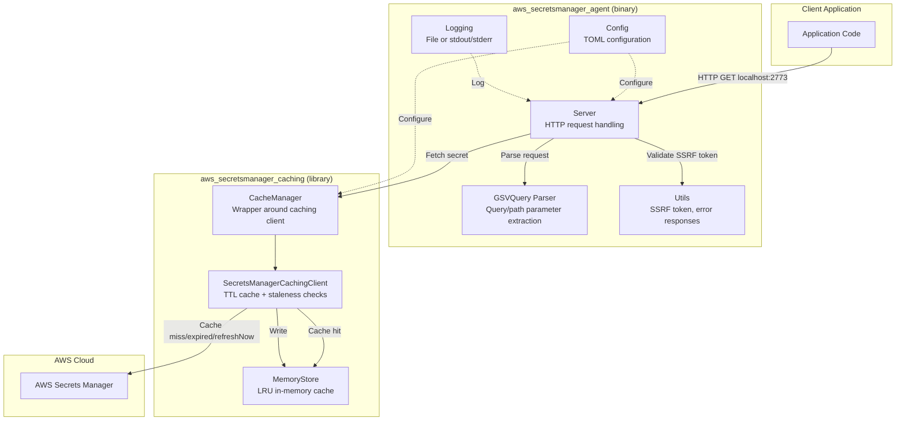
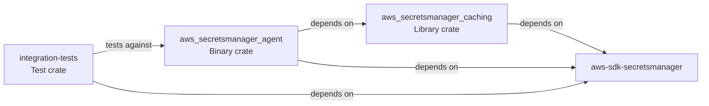
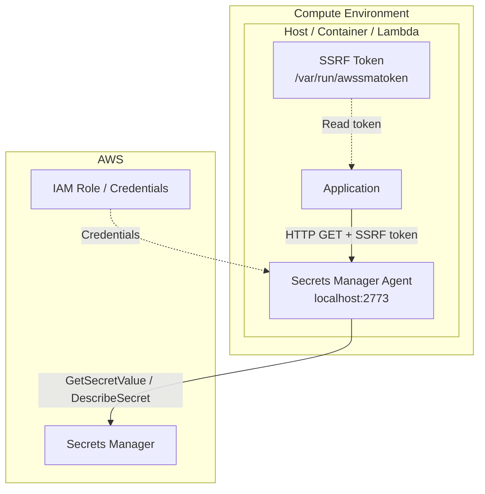

# Architecture

## Overview

The AWS Secrets Manager Agent follows a layered architecture where an HTTP server accepts localhost requests, validates them for security, and delegates to a caching layer that manages secret retrieval and TTL-based caching against the AWS Secrets Manager service.

## Crate Dependency Graph

## Design Patterns

### Layered Architecture
- **Presentation layer**: HTTP server (`server.rs`) handles connections, validates requests
- **Application layer**: `CacheManager` bridges HTTP to caching, `GSVQuery` parser extracts parameters
- **Domain layer**: `SecretsManagerCachingClient` implements caching logic with TTL, staleness detection
- **Data layer**: `SecretStore` trait with `MemoryStore` implementation, LRU eviction

### Trait-Based Abstraction
The `SecretStore` trait (`secret_store/mod.rs`) defines the storage interface. `MemoryStore` is the default implementation. This allows alternative store implementations without changing the caching client.

### Configuration-Driven Behavior
All runtime behavior is configurable via TOML: port, TTL, cache size, SSRF headers, logging, region, max connections, path prefix. Defaults are sensible for production use.

### Security by Default
- SSRF token validation on every request (except `/ping`)
- Rejects `X-Forwarded-For` headers (proxy protection)
- Localhost-only binding
- Post-quantum ML-KEM key exchange as highest priority by default

### Testability
- `CacheManager` swaps the real AWS client for a mock in unit tests via conditional compilation (`#[cfg(test)]`)
- `main.rs` uses callback injection (`report` and `end` functions) to make the server testable
- Integration tests spawn the real agent binary as a child process

## Deployment Architecture

Supported deployment targets:
- **EC2**: Install script creates systemd services (`awssmaseedtoken.service`, `awssmastartup.service`)
- **ECS/EKS**: Sidecar container sharing network namespace with application container
- **Lambda**: Packaged as Lambda extension layer
- **Docker**: Multi-stage build (rust:alpine → scratch)
