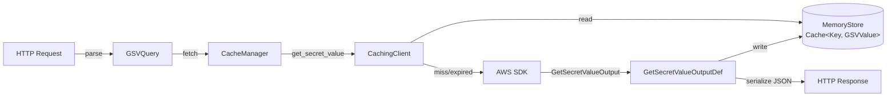

# Data Models

## Agent Crate Models

### GSVQuery
**File**: `aws_secretsmanager_agent/src/parse.rs`

Parsed representation of an incoming HTTP request for a secret.

```rust
pub struct GSVQuery {
    pub secret_id: String,           // Secret name or ARN (required)
    pub version_id: Option<String>,  // Specific version UUID
    pub version_stage: Option<String>, // Version stage label (e.g., AWSCURRENT)
    pub refresh_now: bool,           // Bypass cache (default: false)
}
```

Constructed via:
- `try_from_query(uri)` — for `/secretsmanager/get?secretId=...` requests
- `try_from_path_query(uri, prefix)` — for `/v1/{secretId}` requests

### Config
**File**: `aws_secretsmanager_agent/src/config.rs`

Runtime configuration loaded from TOML file or defaults.

```rust
pub struct Config {
    log_level: LogLevel,
    log_to_file: bool,
    http_port: u16,
    ttl: Duration,
    cache_size: NonZeroUsize,
    ssrf_headers: Vec<String>,
    ssrf_env_variables: Vec<String>,
    path_prefix: String,
    max_conn: usize,
    region: Option<String>,
    ignore_transient_errors: bool,
    validate_credentials: bool,
}
```

### ConfigFile
**File**: `aws_secretsmanager_agent/src/config.rs`

Intermediate deserialization target from TOML. All fields are strings for flexible parsing. Validated and converted to `Config` via `Config::build()`.

### LogLevel
**File**: `aws_secretsmanager_agent/src/config.rs`

```rust
pub enum LogLevel {
    Debug, Info, Warn, Error, None,
}
```

### HttpError
**File**: `aws_secretsmanager_agent/src/error.rs`

```rust
pub struct HttpError(pub u16, pub String);  // (status_code, message)
```

### Server
**File**: `aws_secretsmanager_agent/src/server.rs`

```rust
pub struct Server {
    listener: Arc<TcpListener>,
    cache_mgr: Arc<CacheManager>,
    ssrf_token: Arc<String>,
    ssrf_headers: Arc<Vec<String>>,
    path_prefix: Arc<String>,
    max_conn: usize,
}
```

All fields wrapped in `Arc` for safe sharing across tokio tasks.

### CacheManager
**File**: `aws_secretsmanager_agent/src/cache_manager.rs`

```rust
pub struct CacheManager(SecretsManagerCachingClient);
```

Newtype wrapper. Translates SDK errors to HTTP status codes.

---

## Caching Crate Models

### GetSecretValueOutputDef
**File**: `aws_secretsmanager_caching/src/output.rs`

Serializable mirror of the AWS SDK's `GetSecretValueOutput` (which is `#[non_exhaustive]` and lacks serde support).

```rust
pub struct GetSecretValueOutputDef {
    pub arn: Option<String>,
    pub name: Option<String>,
    pub version_id: Option<String>,
    pub secret_string: Option<String>,    // Skipped if None during serialization
    pub secret_binary: Option<BlobDef>,   // Skipped if None during serialization
    pub version_stages: Option<Vec<String>>,
    pub created_date: Option<SystemTime>, // Serialized as epoch seconds with fractions
}
```

### BlobDef
**File**: `aws_secretsmanager_caching/src/output.rs`

Wrapper for binary secret data. Serializes/deserializes as base64.

### DateTimeDef
**File**: `aws_secretsmanager_caching/src/output.rs`

Custom serde adapter for `SystemTime` ↔ epoch seconds with fractional precision.

### GetSecretValueOutput (Wrapper)
**File**: `aws_secretsmanager_caching/src/secret_store/mod.rs`

```rust
pub struct GetSecretValueOutput(pub GetSecretValueOutputDef);
```

Newtype wrapper used in the store interface.

### SecretStoreError
**File**: `aws_secretsmanager_caching/src/secret_store/mod.rs`

```rust
pub enum SecretStoreError {
    ResourceNotFound,                          // Secret doesn't exist in store
    CacheExpired(Box<GetSecretValueOutputDef>), // TTL expired, carries stale value
    Unhandled(Box<dyn Error + Send + Sync>),   // Unexpected error
}
```

`CacheExpired` carries the stale value so the caching client can serve it on transient errors when `ignore_transient_errors` is true.

### MemoryStore
**File**: `aws_secretsmanager_caching/src/secret_store/memory_store/mod.rs`

```rust
pub struct MemoryStore {
    cache: Cache<Key, GSVValue>,
    ttl: Duration,
}
```

### Key
**File**: `aws_secretsmanager_caching/src/secret_store/memory_store/mod.rs`

Cache key combining secret identity and version selector.

```rust
struct Key {
    secret_id: String,
    version_id: Option<String>,
    version_stage: Option<String>,
}
```

### GSVValue
**File**: `aws_secretsmanager_caching/src/secret_store/memory_store/mod.rs`

Cache value with timestamp for TTL checking.

```rust
struct GSVValue {
    data: GetSecretValueOutputDef,
    created_at: Instant,
}
```

### Cache\<K, V\>
**File**: `aws_secretsmanager_caching/src/secret_store/memory_store/cache.rs`

Generic LRU cache backed by `LinkedHashMap`.

```rust
pub struct Cache<K, V> {
    map: LinkedHashMap<K, V>,
    max_size: NonZeroUsize,
}
```

Evicts the oldest entry when `max_size` is reached on insert.

### SecretsManagerCachingClient
**File**: `aws_secretsmanager_caching/src/lib.rs`

```rust
pub struct SecretsManagerCachingClient {
    asm_client: SecretsManagerClient,
    store: RwLock<Box<dyn SecretStore>>,
    ignore_transient_errors: bool,
}
```

### CacheMetrics (debug only)
**File**: `aws_secretsmanager_caching/src/lib.rs`

```rust
#[cfg(debug_assertions)]
struct CacheMetrics {
    hits: AtomicU32,
    misses: AtomicU32,
    refreshes: AtomicU32,
}
```

Only compiled in debug builds. Tracks cache performance counters.

---

## Data Flow Summary


