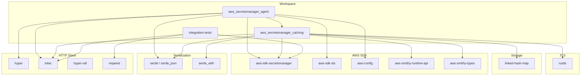

# Dependencies

## Runtime Dependencies

### aws_secretsmanager_agent

| Dependency | Version | Purpose |
|-----------|---------|---------|
| `hyper` | 1 | HTTP/1.1 server |
| `tokio` | 1 | Async runtime (multi-threaded, networking, macros) |
| `http-body-util` | 0.1 | HTTP body utilities for hyper |
| `hyper-util` | 0.1 | Tokio integration for hyper |
| `bytes` | 1 | Efficient byte buffer handling |
| `serde` | 1 | Serialization framework |
| `serde_json` | 1 | JSON serialization |
| `serde_derive` | 1 | Derive macros for serde |
| `config` | 0.14 | TOML configuration file parsing |
| `pretty_env_logger` | 0.5 | Console logging (development) |
| `log` | 0.4.29 | Logging facade |
| `log4rs` | 1.2.0 | File-based logging with rotation (gzip feature) |
| `url` | 2 | URL/query string parsing |
| `aws-config` | 1 | AWS SDK configuration and credential loading |
| `aws-sdk-secretsmanager` | 1 | AWS Secrets Manager SDK client |
| `aws-smithy-runtime-api` | 1 | SDK interceptor API for User-Agent modification |
| `aws-sdk-sts` | 1 | STS client for credential validation |
| `aws_secretsmanager_caching` | 2.0.0 (path) | In-memory caching library (workspace crate) |

### aws_secretsmanager_caching

| Dependency | Version | Purpose |
|-----------|---------|---------|
| `aws-sdk-secretsmanager` | 1 | AWS Secrets Manager SDK client |
| `aws-smithy-runtime-api` | 1 | SDK interceptor API |
| `aws-smithy-types` | 1 | SDK type conversions (Blob, DateTime) |
| `serde` | 1 | Serialization (with derive feature) |
| `serde_json` | 1 | JSON serialization |
| `serde_with` | 3 | Custom serde adapters (timestamp, base64) |
| `thiserror` | 2 | Derive macro for error types |
| `tokio` | 1 | Async runtime (RwLock, sync primitives) |
| `linked-hash-map` | 0.5.6 | Insertion-ordered HashMap for LRU cache |
| `aws-config` | 1 | AWS SDK configuration |
| `rustls` | 0 | TLS implementation (with optional FIPS feature) |
| `log` | 0.4.29 | Logging facade |

### integration-tests

| Dependency | Version | Purpose |
|-----------|---------|---------|
| `tokio` | 1 | Async runtime (process spawning, I/O) |
| `reqwest` | 0.12 | HTTP client for making test requests (rustls-tls) |
| `serde_json` | 1 | JSON parsing of responses |
| `aws-config` | 1 | AWS SDK configuration |
| `aws-sdk-secretsmanager` | 1 | Create/manage test secrets |
| `url` | 2 | URL construction |
| `derive_builder` | 0.20 | Builder pattern derive for test query structs |

## Dev Dependencies

| Dependency | Crate | Purpose |
|-----------|-------|---------|
| `aws-smithy-runtime` (test-util) | agent | Mock SDK client for unit tests |
| `aws-smithy-types` | agent | Type conversions in tests |
| `http` | agent | HTTP types for test assertions |
| `aws-smithy-mocks` | caching | Mock SDK responses |
| `aws-smithy-runtime` (test-util, wire-mock) | caching | Wire-level SDK mocking |
| `tokio-test` | caching | Async test utilities |
| `criterion` | caching | Benchmarking framework |
| `rand` | caching | Random data generation for benchmarks |

## Build & CI Dependencies

| Tool | Purpose |
|------|---------|
| `cargo-deny` | License compliance checking |
| `cargo-llvm-cov` | Code coverage (LLVM-based) |
| `cargo fmt` | Code formatting (rustfmt) |
| `cargo clippy` | Linting |
| `codecov` | Coverage reporting (GitHub Actions) |

## Dependency Graph

## License Compliance

Managed via `deny.toml` with `cargo-deny`. Allowed licenses:
- MIT
- Apache-2.0
- Unicode-3.0
- ISC
- BSD-3-Clause
- OpenSSL
- 0BSD
- CDLA-Permissive-2.0

Checked in CI on every push and PR.
