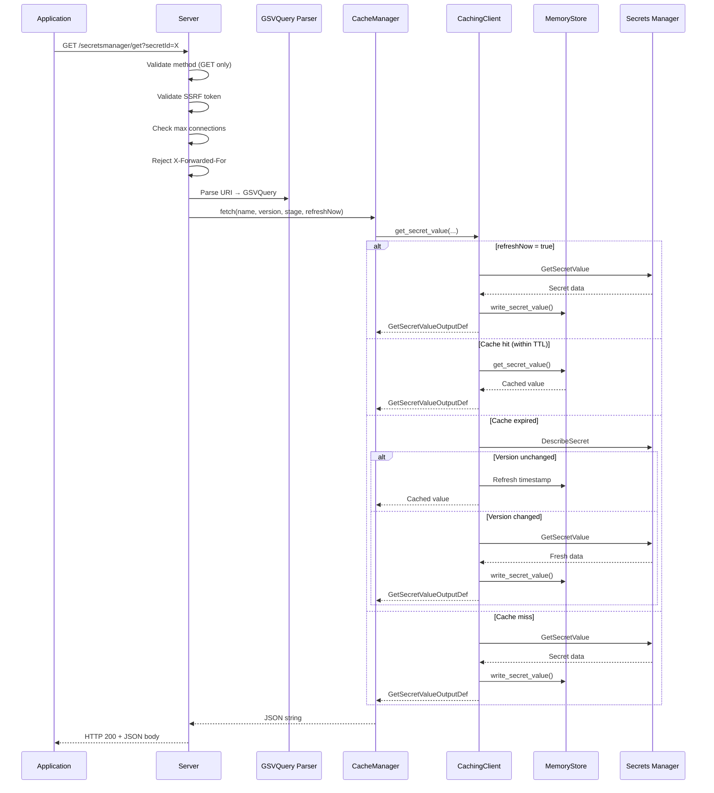
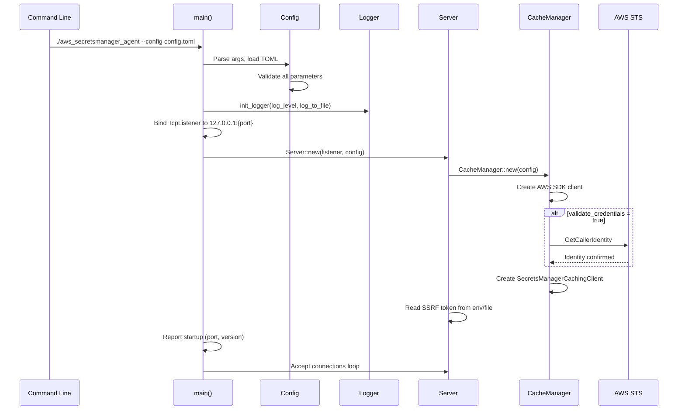
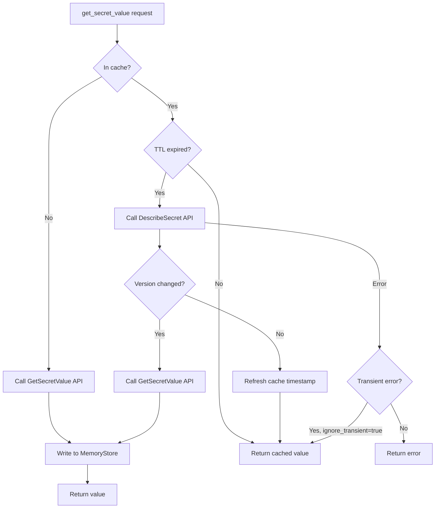
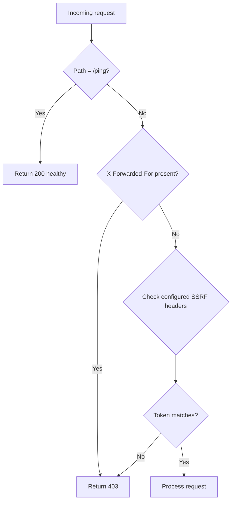
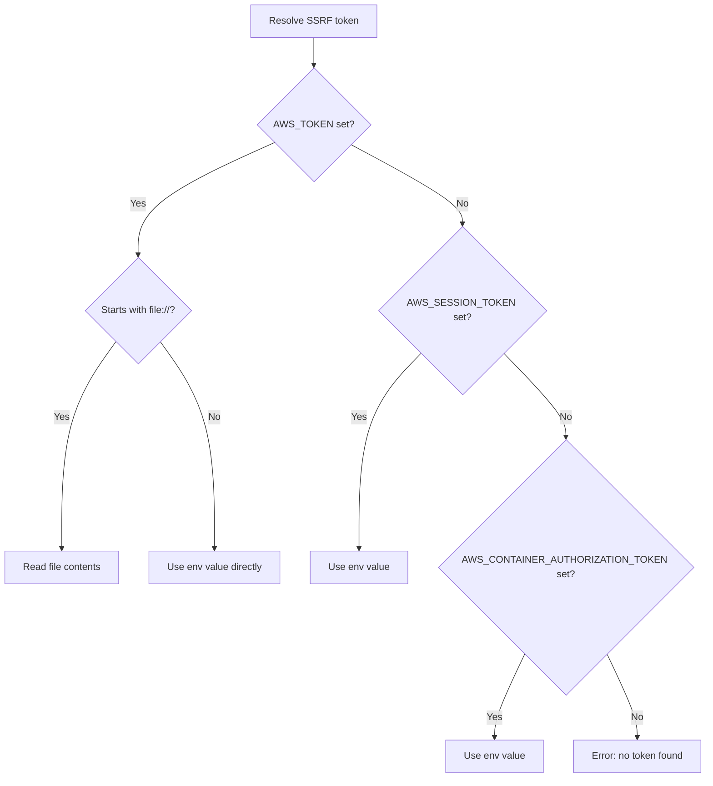
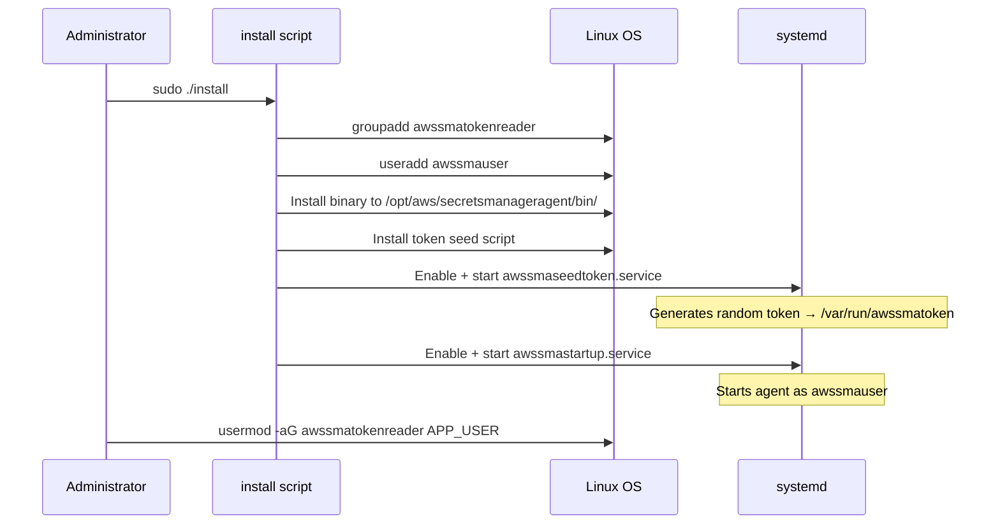
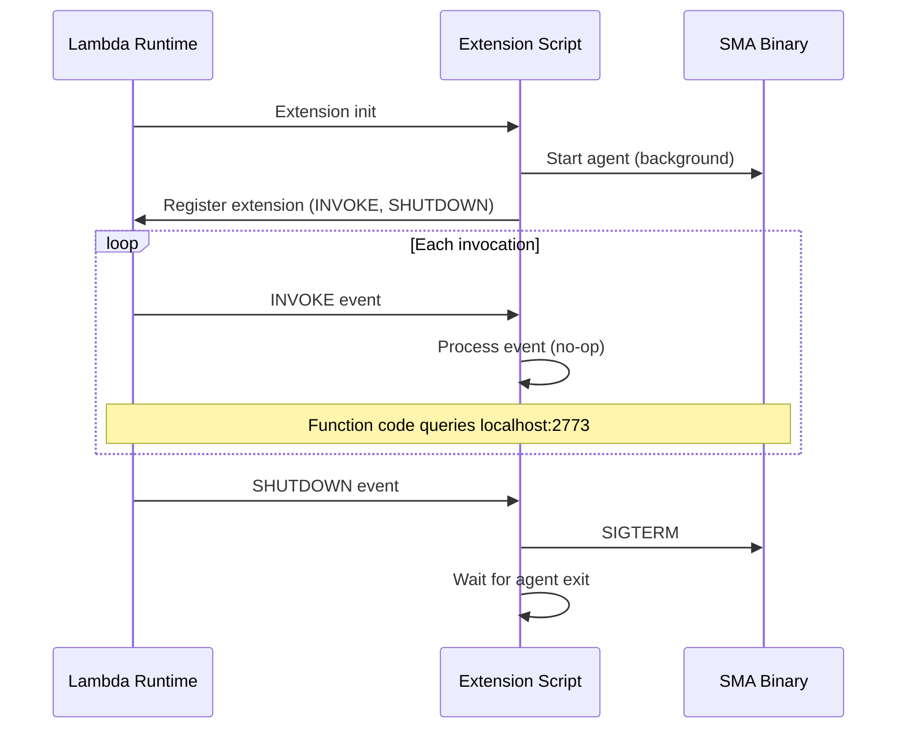

# Workflows

## Secret Retrieval Flow

The primary workflow — an application requests a secret from the agent.

## Agent Startup Flow

## Cache TTL and Staleness Check

## SSRF Token Validation

## SSRF Token Resolution

On startup, the agent resolves the SSRF token by checking environment variables in order:

## EC2 Installation Flow

## Lambda Extension Lifecycle

